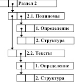
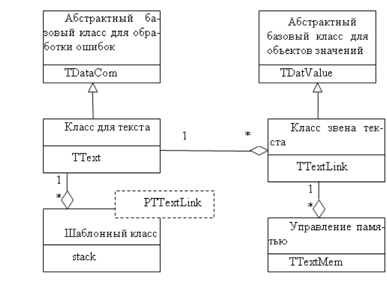

# Лабораторная работа №6. Тексты#

## Введение ##

Обработка текстовой информации на компьютере широко применяется в различных областях человеческой деятельности: образование, наука, документооборот, кадровый и бухгалтерский учет и др. Вне зависимости от назначения текста типовыми операциями обработки являются создание, просмотр, редактирование и сохранение информации. В связи с тем, что объем текстовой информации может являться очень большим, для эффективного выполнения операций с ней необходимо выбрать представление текста, обеспечивающее структурирование и быстрый доступ к различным элементам текста. Так, текст можно представить в виде линейной последовательности страниц, каждая из которых есть линейная последовательность строк, которые  в свою очередь являются линейными последовательностями слов. Такое представление можно осуществлять с любой степенью детализации в зависимости от особенностей прикладной задачи.
В рамках лабораторной работы рассматривается задача разработки учебного редактора текстов, в котором для представления данных используется иерархический связный список. Подобная иерархическая структура представления может применяться при компьютерной реализации математических моделей в виде деревьев и, тем самым, может иметь самое широкое применение в самых различных областях приложений. 

##  Основные понятия и определения

**Текст** – это несколько предложений, связанных друг с другом по смыслу и грамматически. В рамках лабораторной работы в качестве примеров текстов рассматриваются тексты программ.

**Редактор текстов** – программный комплекс, обеспечивающий выполнение операций обработки текста: создание, просмотр, редактирование и сохранение. Специализированные редакторы текстов могут поддерживать выполнение дополнительных операций (например, проверку синтаксиса или контекстный поиск). 

**Иерархический связный список** – это многосвязный список, в котором на каждое звено имеется ровно один указатель, а каждое звено содержит два указателя (один на следующее звено в том же уровне, другой на звено в нижерасположенном уровне).

## Требования к лабораторной работе

В рамках лабораторной работы ставится задача разработки учебного редактора текстов с поддержкой следующих операций:

-	выбор текста для редактирования (или создание нового текста);
-	демонстрация текста на экране дисплея;
-	поддержка средств указания элементов (уровней) текста;
-	вставка, удаление и замена строк текста;
-	запись подготовленного текста в файл.

При выполнении операций чтения (при выборе для редактирования уже существующего текста) и записи редактор должен использовать стандартный формат, принятый в файловой системе для представления текстовых файлов, обеспечивая тем самым совместимость учебного редактора текстов и существующего программного обеспечения. 

## Условия и ограничения

В рамках выполнения данной лабораторной работы могут быть использованы следующие основные допущения:

1.	При планировании структуры текста в качестве самого нижнего уровня можно рассматривать уровень строк.
2. В качестве тестовых текстов можно рассматривать текстовые файлы программы.

## Структуры данных

При выборе модели представления текста необходимо учитывать, какие операции будут выполняться. Можно рассмотреть несколько моделей представления текста: текст можно рассматривать как линейную последовательность символов, как линейную последовательность строк, как линейную последовательность страниц и т.д.

Единство возможных моделей текста можно обеспечить, если при введении каждого более высокого уровня использовать все ранее введенные (ниже расположенные) структуры представления. Такой подход может быть реализован с использованием иерархических связных списков. Звенья такого списка содержат по два указателя: один используется для организации отношения следования по элементам текста одного и того же уровня, а другой – для указания отношения следования по иерархии уровней представления текста (от более высокого уровня к ниже расположенному).

Необходимым условием применения связного списка как структуры хранения текста является возможность нахождения такого унифицированного типа звеньев, который можно было бы использовать на любых уровнях представления текста, так как реализация своего типа звеньев для каждого уровня приведет к увеличению трудоемкости управления памятью и дублированию программ обработки. Возможное решение при выборе структуры звеньев может состоять в следующем:

-	каждое звено структуры хранения содержит два поля указателей и поле для хранения данных;
-	нижний уровень иерархической структуры звеньев ограничивается 
-  уровнем строк, а не символов. Это повышает эффективность использования памяти, так как в случае отдельного уровня для хранения символов, затраты на хранение служебной информации (указатели) в несколько раз превышают затраты на хранение самих данных.При использовании строк в качестве атомарных элементов поле для хранения данных является массивом символов заданного размера;
-	количество уровней и количество звеньев на каждом уровне может быть произвольным;
-	при использовании звена на атомарном уровне поле указателя на нижний уровень структуры устанавливается равным значению NULL;
-	при использовании звена на структурных уровнях представления текста поле для хранения строки текста используется для размещения наименования соответствующего элемента текста;
-	количество используемых уровней представления в разных фрагментах текста может быть различным.

При выбранном способе представления для следующего примера текста:

Раздел 2

1.1.	Полиномы

  1.	Определение
  2.	Структура

1.2.	Тексты

  1.	Определение
  2.	Структура

структура хранения текста будет иметь вид:




## Алгоритмы

Для индикации позиции в тексте, относительно которой выполняются операции перемещения по тексту, вводится понятие текущей строки. 
Для перемещения по тексту предлагается реализовать следующие операции:

- переход к первой строке текста;
- переход к следующему элементу в том же уровне;
- переход к элементу в нижерасположенном уровне;
- переход к предыдущей позиции в тексте.

Разработанная структура хранения текста обеспечивает возможность передвижения по структуре только в направлении следующих или нижерасположенных элементов. Движение по элементам текста в обратном направлении возможно только при условии, если адреса звеньев, на которые необходимо переместиться, были каким-либо способом запомнены ранее. Возможный способ организации запоминания этих адресов состоит в использовании стека.

Необходимо реализовать операции вставки и удаления элементов текста. Операции должны применяться для текущего и нижерасположенного уровней. Для операции вставки необходимо разработать вариант образования новых подуровней – так, например, выполнение операции вставки для подуровня может быть представлено следующим образом


Для операции удаления должны быть предусмотрены варианты удаления как отдельных строк, так и всего содержимого подуровней текста.

## Обход текста

Для последовательного доступа ко всем элемента текста (например, для печати текста) необходимо совершить обход текста. 

Схема обхода может состоять в следующем. При начале обхода следует перейти от начала текста (корня дерева) до атомарного уровня по указателям нижерасположенных уровней, запоминая при этом все пройденные звенья в стеке. После обработки найденной строки, далее следует переходить по строкам того же уровня, до последней строки в этом уровне. После обхода уровня текущего уровня необходимо извлечь звено из стека и повторить всю выше приведенную последовательность действий. Обход текста будет завершен, когда стек пуст. Данная схема обхода представляет вариант TDN (top – down – next, вершина ‑ нижний уровень – следующий элемент).

При запонимании иерархически представленного текста в текстовом файла необходимо обеспечить запоминание стуктуры текста. Возможный вариант состоит в использовании специальных символов для выделения моментов начала и завершения уровные текста (в качестве таких служебных символов можно использовать, например, знаки фигурных скобок «{» и «}»). 

## Итератор

Как и при работе с линейными списками, использование итератора  позволяет упростить реализацию операций с текстом и обеспечивает унифицированный способ обработки элементов структуры данных. 

Итератор включет следующие методы:

- инициализация (установка на корневое звено)

В этом методе происходит опустошение стека, после чего в стек помещаются указатель на корневое звено, указатели на следующее звено и следующее в подуровне. 

- проверка завершения текста

Если стек пуст, то текст завершен.

- переход к следующему звену

В стек помещаются указатели на следующее звено и на звено, следующее в подуровне.

## Копирование

Для копирования текста необходимо осуществить обход текста. Так как структура текста является нелинейной, то копирование производится за два прохода, при этом для навигации по исходному тексту и тексту копии используется один объединенный стек. 

Первый проход производится при подъеме на строку из подуровня – для текущей строки выполняется:

-	создание копии звена;
-	заполнение в звене-копии поля указателя подуровня pDown 
(подуровень уже скопирован); 
-	запись в звене-копии в поле данных значения “Copy”, используемое как маркер для распознавания звена при попадании на него при втором проходе; предполагается, что в тексте данный маркер не встречается;
-	запись в звене-копии в поле указателя следующего звена pNext указателя на звено-оригинал (для возможности последующего копирования текста исходной строки);
-	запись указателя на звено-копию в стек.
Второй проход производится при извлечении звена-копии из стека (распознается по маркеру “Copy”)– в этом случае необходимо выполнить:
-	заполнение в звене-копии полей данных и указателя следующего звена; 
-	указатель на звено-копию запоминается в служебной переменной.

## Сборка мусора
При удалении разделов текста для освобождения звеньев следует учитывать следующие моменты:

-	обход всех звеньев удаляемого текста может потребовать длительного времени;
-	при допущении множественности ссылок на разделы текста (для устранения дублирования одинаковых частей) удаляемый текст нельзя исключить, так как он может быть задействован в других фрагментах текста.

Для решения этих проблем можно не освобождать память в момент удаления, а фиксировать удаление текста установкой соответствующего указателя в состояние  NULL. При такой реализации операции удаления может возникнуть ситуация, когда в памяти, отведенной под хранение текста, будут присутствовать звенья, на которые нет указателей в тексте. Таким образом, эти звенья не могут быть возвращены системе для последующего использования, а память считается занятой (возникает так называемая утечка памяти). Такие звенья называются «мусором».

Наличие «мусора» в системе может быть допустимым, если имеющейся свободной памяти достаточно для работы программ. В случае нехватки памяти необходимо выполнить «сборку мусора» (garbage collection).

Для осуществления данного подхода необходимо программно реализовать систему управления памятью для представления текстов. Для данной системы управления память должна выделяться полностью при начале работы программы, размер выделяемой памяти может определяться как параметр системы. Для фиксации состояния памяти в классе TTextLink может быть определена статическая переменная MemHeader класс 

```
TTextMem:
class TTextMem {
  PTTextLink pFirst;      // первое звено
  PTTextLink pLast;       // последнее звено 
  PTTextLink pFree;       // первое свободное звено 
};
```

Для начального выделения и форматирования памяти используется статический метод InitMemSystem класса TTextLink. В этом методе ыделяется память для хранения текстов. Указатель pFirst устанавливается на начало этого массива (после приведения типа к типу указателя на звено), указатель pLast на последний элемент массива. Далее этот массив размечается как список свободных звеньев, в самом начале работы список свободных звеньев может быть упорядочен по памяти.. 

Для выделения памяти под звено перегружается оператор new, который выделяет новое звено из списка свободных звеньев. При освобождении звена в перегруженном операторе delete происходит возвращение памяти в список свободных звеньев.

Алгоритм  «сборки мусора» состоит из трех этапов. На первом этапе происходит обход текста и маркирование звеньев текста специальными символами (например, «&&&»). На втором этапе происходит обход и маркирование списка свободных звеньев. На третьем этапе происходит проход по всему непрерывному участку памяти как по непрерывному набору звеньев. Если звено промаркировано, то маркер снимается. В противном случае, найдено звено, на которое нет ссылок («мусор»), и это звено возвращается в список свободных звеньев.
## Структура проекта

С учетом сформулированных выше предложений к реализации целесообразной представляется следующая модульная структура программы:

* TTextLink.h, TTextLink.cpp – модуль с классом для звена текста;
* TText.h, TText.cpp – модуль с классом, реализующим операции над текстом;
* TTextViewer.h, TTextViewer.cpp – модуль с классом, реализующим визуализацию текста;


## Спецификации классов


С учетом предложенных к реализации алгоритмов можно сделать следующие объявления классов.

Класс TTextMem для системы управления памятью и класс TTextLink для строк текста (файл TTextLink.h): 

```
class TTextLink;
typedef TTextLink *PTTextLink;
typedef char TStr[TextLineLength];
class TTextMem {
  PTTextLink pFirst;     // указатель на первое звено
  PTTextLink pLast;      // указатель на последнее звено
  PTTextLink pFree;      // указатель на первое свободное звено
  friend class TTextLink;
};
typedef TTextMem *PTTextMem;

class TTextLink : public TDatValue {
protected:
 TStr Str;  // поле для хранения строки текста
 PTTextLink pNext, pDown;  // указатели по тек. уровень и на подуровень
 static TTextMem MemHeader; // система управления памятью
public:
 static void InitMemSystem (int size=MemSize); // инициализация памяти
 static void PrintFreeLink (void);  // печать свободных звеньев
 void * operator new (size_t size); // выделение звена
 void operator delete (void *pM);   // освобождение звена
 static void MemCleaner (const TText &txt); // сборка мусора
 TTextLink (Tstr s = NULL, PTTextLink pn = NULL, PTTextLink pd = NULL){
  pNext = pn; pDown = pd;
  if (s != NULL) strcpy(Str,s); else Str[0]=’\0’;
 }
 ~TTextLink() {}
 int IsAtom () {return pDown == NULL;} // проверка атомарности звена
 PTTextLink GetNext() {return pNext;}
 PTTextLink GetDown() {return pDown;}
 PTDatValue GetCopy() {return new TTextLink(Str,pNext,pDown);}
protected:
 virtual void Print (ostream &os) {os << Str;}
 friend class TText;
};
```

Класс для представления иерархического связного списка (TText.h):

```
class TText : public TDataCom {
protected:
 PTTextLink pFirst;      // указатель корня дерева
 PTTextLink pCurrent;      // указатель текущей строки
 stack< PTTextLink > Path; // стек траектории движения по тексту
 stack< PTTextLink > St;   // стек для итератора
 PTTextLink GetFirstAtom (PTTextLink pl); // поиск первого атома
 void PrintText (PTTextLink ptl);         // печать текста со звена ptl
 PTTextLink ReadText (ifstream &TxtFile); //чтение текста из файла
public:
 TText (PTTextLink pl = NULL);
 ~TText () {pFirst =NULL;}
 PTText getCopy();
// навигация
 int GoFirstLink (void); // переход к первой строке
 int GoDownLink (void);  // переход к следующей строке по Down
 int GoNextLink (void);  // переход к следующей строке по Next
 int GoPrevLink (void);  // переход к предыдущей позиции в тексте
// доступ
 string GetLine(void);   // чтение текущей строки
 void SetLine ( string s); // замена текущей строки 
// модификация
 void InsDownLine (string s);    // вставка строки в подуровень
 void InsDownSection (string s); // вставка раздела в подуровень
 void InsNextLine (string s);    // вставка строки в том же уровне
 void InsNextSection (string s); // вставка раздела в том же уровне
 void DelDownLine (void);        // удаление строки в подуровне
 void DelDownSection (void);     // удаление раздела в подуровне
 void DelNextLine (void);        // удаление строки в том же уровне
 void DelNextSection (void);     // удаление раздела в том же уровне
// итератор
 int Reset (void);              // установить на первую звапись
 int IsTextEnded (void) const;  // текст завершен?
 int GoNext (void);             // переход к следующей записи
//работа с файлами
 void Read (char * pFileName);  // ввод текста из файла
 void Write (char * pFileName); // вывод текста в файл
//печать
 void Print (void);             // печать текста
};
```
